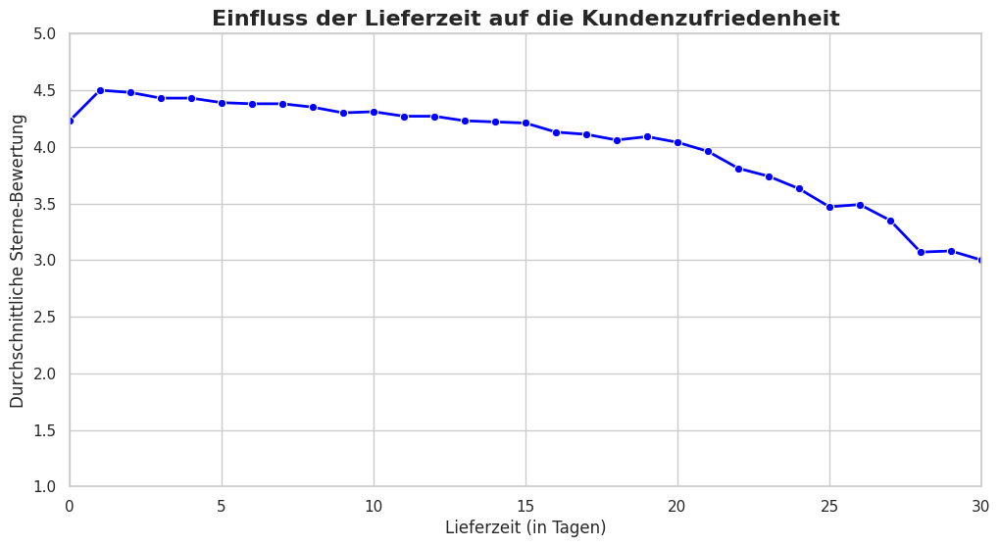
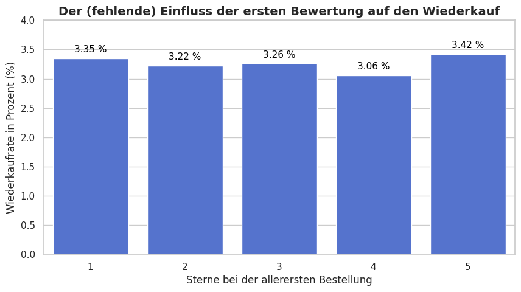
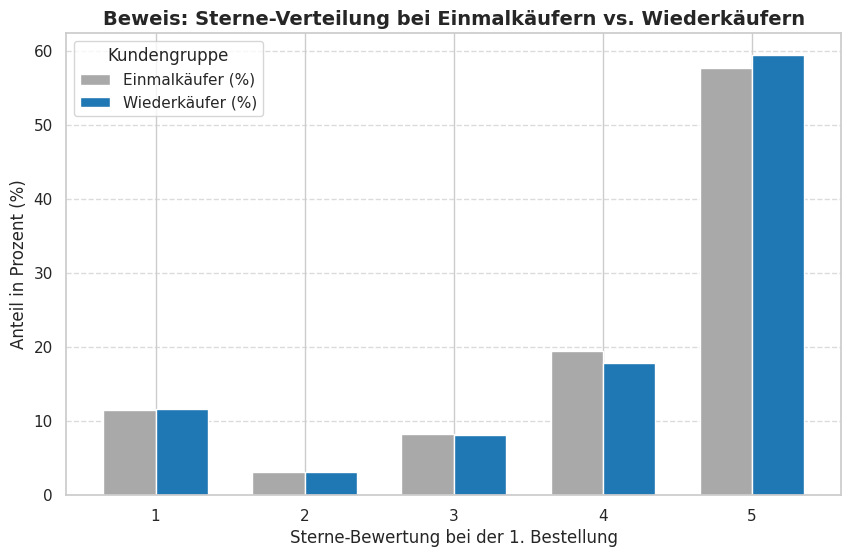
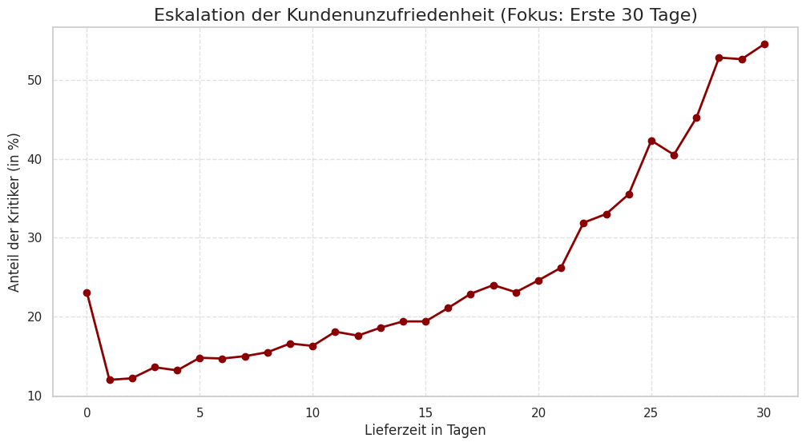
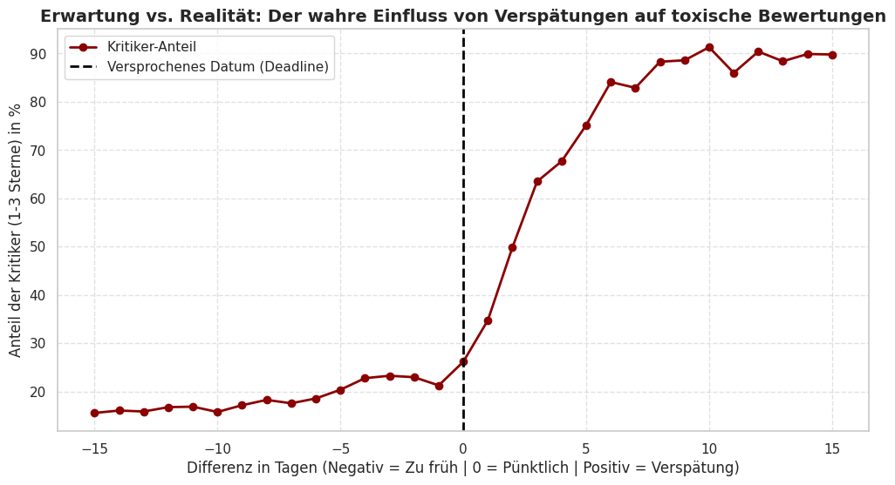
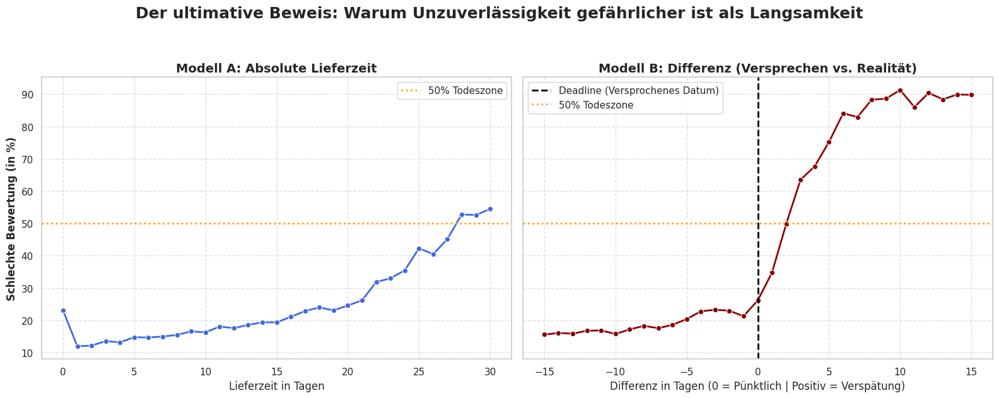
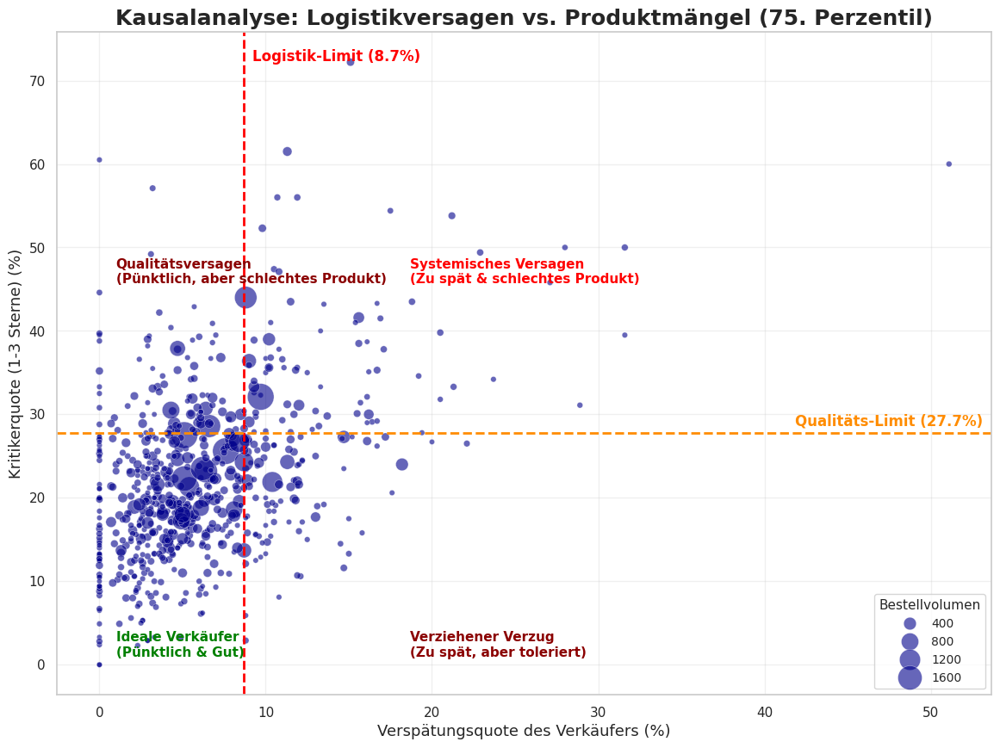
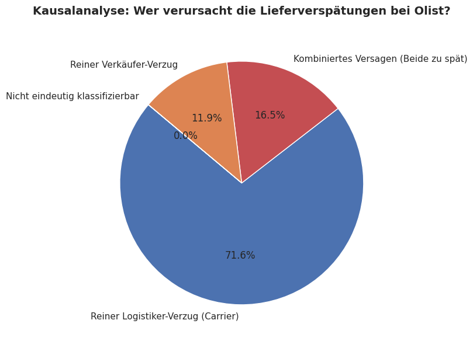

# **📊 E-Commerce Datenanalyse: Logistik, Kundenzufriedenheit und Reputationsrisiken**

Projekt-Status: 🔵 Abgeschlossen (Completed)

### **📌 Projektziel und Forschungsfokus**
Das primäre Ziel dieses Projekts ist eine umfassende, datengestützte Untersuchung der kausalen Zusammenhänge zwischen operativen Kernprozessen (Logistik und Händlerqualität) und der daraus resultierenden Kundenzufriedenheit auf der Olist-Plattform. Die Analyse dient dem Zweck, die mathematischen Dynamiken zwischen betrieblichen Kennzahlen und Nutzerbewertungen zu entschlüsseln, um fundierte Grundlagen für strategische Management-Entscheidungen zu schaffen.

### **🛠 Tech Stack & Tools**
- **Sprache:** Python
- **Data Manipulation:** Pandas, NumPy
- **Datenvisualisierung:** Matplotlib, Seaborn
- **Methodik:** Agiles Projektmanagement, Explorative Datenanalyse (EDA)

---

### 📑 Inhaltsverzeichnis
- Teil 1: Abhängigkeit zwischen Lieferzeit und Kundenzufriedenheit
- Teil 2: Untersuchung der Kundenloyalität und Validierung des Einmalkäufer Modells
- Teil 3: Analyse der Lieferverzögerung und mathematischer Nachweis des Erwartungsbruchs
- Teil 4.1: Asymmetrische Verteilung des Reputationsschadens durch Minderperformer
- Teil 4.2: Korrelationsanalyse und perzentilbasierte Quadranten Gruppierung der Verkäufer
- Teil 4.3: Kausalanalyse der logistischen Engpässe und Zuordnung der Verantwortung zwischen Carrier und Verkäufer
- Teil 4.4: Umsatzrelevanz minderperformanter Großhändler und Bewertung des Reputationsrisikos
- Teil 5: Synthese der Ergebnisse und Strategischer Aktionsplan

---

## Teil 1: Abhängigkeit zwischen Lieferzeit und Kundenzufriedenheit

### **Ziel**
Welchen messbaren Einfluss hat die Lieferzeit auf die vergebenen Sterne-Bewertungen? Wir wollen den exakten Trend Tag für Tag sichtbar machen. Das Ziel ist es, dem Management mit echten Daten zu beweisen, wie schnell Pakete ankommen müssen, um die Zufriedenheit auf einem profitablen Niveau zu halten.

### **Problem & Lösung**
Im Online-Handel ist es sehr teuer, neue Kunden zu gewinnen. Deshalb ist es extrem wichtig, dass bestehende Kunden zufrieden sind und wieder einkaufen. Wenn Kunden wegen langen Lieferzeiten unzufrieden sind und nicht mehr bestellen, verliert das Unternehmen viel Geld.
**Lösung:** Um dies zu analysieren, wurden die Rohdaten geladen, bereinigt und von Textformaten in echte Datumsangaben konvertiert (`order_purchase_timestamp` & `order_delivered_customer_date`). Durch das Zusammenführen der Tabellen über die `customer_id` zu einer Master-Tabelle wurde die exakte Lieferzeit in Tagen (`lieferzeit_tage`) berechnet und mit den Kundenbewertungen verknüpft, um den Durchschnitt der Sterne-Bewertungen pro Liefertag zu ermitteln.

### **Grafik**

### **Grafikanalyse**
**1. Die generelle Übersicht und der Ergebnis**
Das Diagramm zeigt ein sehr klares Bild: Je länger ein Kunde auf sein Paket wartet, desto schlechter wird die Bewertung. 
* Bei einer sehr schnellen Lieferung (1 bis 4 Tage) sind die Kunden am glücklichsten und geben im Durchschnitt fast 4,5 Sterne. 
* Danach geht die Linie eindeutig und konstant nach unten. Bei 30 Tagen Wartezeit sind wir bereits bei nur noch 3 Sternen angekommen.

**2. Warum ist die Linie nicht perfekt glatt?**
 Die Kunden bewerten nicht *nur* die Lieferzeit. Ein Paket kann super schnell ankommen, aber wenn das Produkt kaputt ist oder der Paketbote unfreundlich war, gibt es trotzdem nur 1 Stern. Das sorgt für die kleinen Schwankungen in unserer Linie.
 
* **Das Rätsel um "Tag 0":** Warum ist eine Lieferzeit von 0 Tagen (4.23 Sterne) schlechter als 1 Tag (4.50 Sterne)? In der Realität bedeutet "0 Tage" oft, dass es Probleme gab. Zum Beispiel hat der Kunde die Bestellung sofort wieder storniert oder das System hatte einen Fehler. Das macht Kunden wütend und drückt den Durchschnitt nach unten.
* Diese Datensätze wurden bewusst nicht aus der Analyse entfernt, um die prozessualen Systemfehler und Stornierungsanomalien der Olist-Plattform transparent aufzuzeigen, anstatt die Datenbasis künstlich zu glätten.

---

## Teil 2: Untersuchung der Kundenloyalität und Validierung des Einmalkäufer Modells

### **Ziel**
Ziel dieses Abschnitts ist es, die wissenschaftliche Korrelation zwischen der ersten Kundenerfahrung (Sterne-Bewertung) und der Wahrscheinlichkeit eines erneuten Kaufs (Retention Rate) zu untersuchen. Die logische Ausgangshypothese lautet: Eine hohe Zufriedenheit führt zu einer höheren Kundenbindung.

### **Problem & Lösung**
Bevor wir die Berechnungen durchführen können, müssen wir die relevanten Tabellen korrekt zusammenführen (Mergen). Dabei gibt es eine strukturelle Besonderheit im Datensatz: Das System generiert für jede einzelne Bestellung eine neue `customer_id`. Um echte Wiederkäufer über einen längeren Zeitraum zu identifizieren, müssen wir stattdessen den übergeordneten Schlüssel `customer_unique_id` nutzen.
**Lösung:** Nach der Qualitätskontrolle der IDs wurden die Tabellen zusammengeführt. Über die `customer_unique_id` wurde ermittelt, wie oft jede Kunden-ID im System vorkommt. Die Kunden wurden in zwei Gruppen aufgeteilt (1 Kauf vs. mehr als 1 Kauf), mit einem entsprechenden Wiederkäufer-Flag markiert, chronologisch sortiert und die erste Sterne-Bewertung isoliert.

### **Grafik 1: Der (fehlende) Einfluss auf den Wiederkauf**

### **Grafikanalyse 1**
Das Diagramm zeigt uns eine harte wissenschaftliche Wahrheit: Die Sterne-Bewertung hat fast keinen Einfluss auf die Wiederkaufrate. Egal ob der Kunde sein erstes Paket liebt (5 Sterne) oder hasst (1 Stern), die Chance auf einen zweiten Kauf bleibt fast gleich niedrig (knapp über 3 %). Der Grund dafür ist das Marktplatz-Geschäftsmodell, bei dem Kunden generell nur für Einzelkäufe kommen.

Die Daten widerlegen unsere Ausgangshypothese eindeutig: Es gibt keine statistische Korrelation zwischen der Erstbewertung und der Kundenbindung. Sowohl bei katastrophalen (1 Stern) als auch bei perfekten (5 Sterne) Erfahrungen liegt die Wiederkaufrate konstant bei nur rund 3 %.

---

### **Grafik 2: Sterne-Verteilung bei Einmalkäufern vs. Wiederkäufern**

### **Grafikanalyse 2**
Um die Perspektive zu wechseln, vergleichen wir die Verteilung der ersten Sterne-Bewertungen direkt zwischen den beiden Gruppen. Das Ergebnis ist verblüffend: Die Verteilung der abgegebenen Sterne unterscheidet sich zwischen den abgebrochenen Einmalkäufern und den treuen Wiederkäufern fast überhaupt nicht. Über 57 % der Einmalkäufer hinterließen beim ersten Mal ein perfektes 5-Sterne-Feedback, kehrten aber dennoch nie wieder zurück.

**Der wissenschaftliche Beweis:**
Unsere Analyse der Top-5-Kategorien liefert den unwiderlegbaren Beweis für dieses Kundenverhalten. Olist vertreibt primär langlebige Gebrauchsgüter (wie Bettwäsche, Möbel, Sportgeräte und Computerzubehör). Das bedeutet: Olist funktioniert faktisch als reiner Marktplatz für Einmalkäufer. Die Kunden decken einen spezifischen, selten auftretenden Bedarf und haben danach schlichtweg über Jahre hinweg keinen Grund zurückzukehren – völlig unabhängig davon, wie zufrieden sie mit dem Service waren.

---

## Teil 3: Analyse der Lieferverzögerung und mathematischer Nachweis des Erwartungsbruchs

### **Ziel**
In diesem Abschnitt führen wir eine Sentiment-Analyse durch, um das Risiko einer toxischen Bewertung zu quantifizieren. Ab welchem exakten Liefertag kippt die Stimmung der Kunden statistisch ins Negative? Wir suchen den Punkt, an dem das Risiko einer 1-bis-3-Sterne-Bewertung die 50 %-Marke überschreitet.

### **Problem & Lösung**
Da wir in Teil 2 bewiesen haben, dass Olist fast ausschließlich von Neukunden lebt, ist der öffentliche Ruf (Reviews) die wichtigste Währung des Unternehmens. Wenn zu lange Lieferzeiten zu schlechten Bewertungen führen, schreckt das potenzielle Neukunden ab und gefährdet das gesamte Geschäftsmodell.
**Lösung:** Zur Umsetzung wurde eine Segmentierung vorgenommen: Bewertungen mit 4 & 5 Sternen wurden als "Fan" (False) klassifiziert, während 1, 2 & 3 Sterne als "Kritiker" (True) definiert wurden. Nach dem Zusammenführen mit den Bestelldaten und dem Filtern ungültiger Werte wurde der prozentuale Kritiker-Anteil in Abhängigkeit von den Lieferminuten berechnet, um den exakten Tipping Point zu bestimmen.

---

### **Grafik 1: Eskalation der Kundenunzufriedenheit (Fokus: Erste 30 Tage)**

### **Grafikanalyse 1 (Der logistische Kipppunkt / Tipping Point)**
**Die Ausgangslage (Baseline):** 
Betrachten wir die erste Woche nach der Bestellung (Tag 1 bis 7), sehen wir eine grundlegende Unzufriedenheitsquote (Kritiker) zwischen 12,0 % und 15,0 %. Dies ist die natürliche Basis-Fehlerquote. Selbst wenn die Logistik sehr schnell funktioniert, wird es aufgrund von beschädigten Produkten, falscher Verpackung oder völlig subjektiven Kundenerwartungen immer eine gewisse Basis an negativen Bewertungen geben.

**Der drastische Bruch (Inflection Point):** 
Die Daten zeigen sehr klare und harte Brüche. Ab dem 16. Tag überschreitet der Anteil der toxischen Bewertungen erstmals die 20-%-Marke (21,1 %). Ein noch dramatischerer Sprung erfolgt am 22. Tag, an dem die Quote abrupt auf 31,9 % hochschnellt.

*Warum nennen wir das einen "scharfen Bruch"?* 
Weil sich der Anteil der Kritiker im Vergleich zur Baseline hier faktisch verdoppelt hat. Genau ab diesem Punkt dominieren die logistischen Verzögerungen alle anderen Faktoren, werden zum Hauptproblem und spiegeln sich schonungslos in den Bewertungen wider.

---

### **Grafik 2: Erwartung vs. Realität: Der wahre Einfluss von Verspätungen auf toxische Bewertungen**

### **Grafikanalyse 2 (Die katastrophale Eskalation der Delta-Analyse)**
Wenn wir die Daten jedoch mit brutaler Ehrlichkeit betrachten, stellen wir eine Anomalie fest: Obwohl es ab Tag 16 einen Anstieg gibt, ist die Kluft zwischen einer 5-Tage-Lieferung und einer 15-Tage-Lieferung geschäftlich gesehen viel geringer als erwartet.

Diese Situation zwingt uns, unsere Hypothese kritisch zu überdenken. Wir müssen die Kausalität wissenschaftlich untersuchen und folgende Frage stellen: **Was treibt die Unzufriedenheit der Kunden wirklich an – die absolute Lieferzeit oder der Bruch eines Versprechens?**

Die Daten beweisen: Wenn einem Kunden von Anfang an 15 Tage zugesagt wurden und das Paket in 15 Tagen ankommt, bleibt der Kunde zufrieden. Kommt ein Paket jedoch nach 7 Tagen an, obwohl 3 Tage versprochen waren, sorgt dieser mathematische Bruch des Lieferversprechens (das "Delta") für massive Frustration. Der Erwartungsbruch wiegt psychologisch schwerer als die absolute Langsamkeit. Ein genauer Blick auf unser Diagramm zeigt eine harte geschäftliche Realität: Die Unzufriedenheit steigt bei einer Verspätung nicht langsam, sondern sie explodiert ab der Deadline (Tag 0).

---

### **Grafik 3: Der ultimative Beweis: Warum Unzuverlässigkeit gefährlicher ist als Langsamkeit**

### **Grafikanalyse 3 (Die Synthese – Visueller Beweis für die Relevanz des Expectation Managements)**
Die direkte Gegenüberstellung beider Modelle auf derselben Y-Achse (Schlechte Bewertung in %) liefert den ultimativen, datengestützten Beweis für das Kundenverhalten. Wir betrachten hier den Kontrast zwischen zwei völlig unterschiedlichen psychologischen und logistischen Metriken:

**1. Modell A (Links): Die Toleranz gegenüber Langsamkeit**
Die blaue Kurve zeigt die Entwicklung der Unzufriedenheit gemessen in absoluten Liefertagen (ab dem Kaufmoment). Der Anstieg der Unzufriedenheit verläuft hier moderat. Selbst nach 15 Tagen Wartezeit befindet sich die Quote noch im kontrollierbaren Bereich (~20 %). Es dauert **beachtliche 28 Tage**, bis die kritische 50-%-Marke (Risikozone) erreicht wird.
*(Anmerkung: Die Anomalie an Tag 0 ist in der Regel auf systembedingte Sofortstornierungen oder schwere Fehler im Bestellprozess zurückzuführen und spiegelt keine echte Lieferzeit wider.)*

**2. Modell B (Rechts): Der fatale Effekt der Unzuverlässigkeit**
Die rote Kurve misst die Unzufriedenheit ausgehend vom Versprechen (Deadline). Hier sehen wir keine flache Kurve, sondern eine vertikale Wand. Frühzeitige Lieferungen (links der schwarzen Linie) senken die natürliche Basis-Unzufriedenheit nicht wesentlich. Sobald die Deadline jedoch überschritten wird, eskaliert die Situation katastrophal. Was im Modell A volle 28 Tage dauert, passiert hier in **nur 2 Tagen (+48 Stunden)**: Die Unzufriedenheit durchbricht die 50-%-Risikozone.

**Das finale analytische Urteil:**
Das Diagramm beweist unmissverständlich den psychologischen Kipppunkt unserer Kunden. Unzuverlässigkeit ist weitaus gefährlicher als Langsamkeit. Kunden sind bereit, lange Lieferzeiten zu akzeptieren, solange diese transparent kommuniziert und eingehalten werden. Ein gebrochenes Lieferversprechen wird hingegen sofort und gnadenlos abgestraft.

---

## Teil 4: Wirtschaftliche Relevanz der Verkäuferqualität und Identifikation operativer Risikoträger

In diesem umfassenden Kapitel wird der finanzielle und reputative Einfluss von qualitativen Minderperformern auf das Gesamtökosystem der Olist-Plattform datengestützt analysiert. Da die Plattform existenziell von Neukunden abhängt, spielen Händler, die systematisch schlechte Bewertungen verursachen, eine kritische Rolle für das wirtschaftliche Überleben des Unternehmens.

Um diese Dynamiken präzise zu entschlüsseln, ist die Untersuchung in vier spezialisierte Teilbereiche unterteilt:
- **Teil 4.1:** Asymmetrische Verteilung des Reputationsschadens durch Minderperformer
- **Teil 4.2:** Korrelationsanalyse und perzentilbasierte Quadranten-Gruppierung der Verkäufer
- **Teil 4.3:** Kausalanalyse der logistischen Engpässe und Zuordnung der Verantwortung zwischen Carrier und Verkäufer
- **Teil 4.4:** Umsatzrelevanz minderperformanter Großhändler und Bewertung des Reputationsrisikos

---
## Teil 4.1: Asymmetrische Verteilung des Reputationsschadens durch Minderperformer

### **Ziel**
Wie ungleich ist der Reputationsschaden auf der Plattform verteilt und in welchem Maße verzerren wenige qualitative Ausreißer (Minderperformer) das algorithmische Gesamtbild der Kundenzufriedenheit? Das Ziel ist es, mathematisch zu beweisen, ob eine kleine Gruppe von schlechten Verkäufern für den Großteil der negativen Bewertungen verantwortlich ist.

### **Problem & Lösung**
Wenn man nur den Durchschnitt aller Bewertungen betrachtet, sieht die Plattform stabil aus. Das Problem ist aber, dass das Management dadurch die echten operativen Risikoträger nicht sieht. Wenn wenige Verkäufer massiven Schaden anrichten, zieht das den Ruf der gesamten Plattform nach unten, ohne dass man die genauen Verursacher kennt.
**Lösung:** Um dies zu lösen, wurden die Verkäufer-IDs gefiltert und analysiert. Es wurde berechnet, wie hoch der Anteil der schlechten Bewertungen (Kritiker) pro Verkäufer ist. Die Verteilung des Reputationsschadens wurde mathematisch über eine statistische Auswertung isoliert, um die Konzentration der negativen Bewertungen exakt zu belegen.

### **Ergebnis der Datenanalyse**
Der berechnete Wert von **63,77 %** ist eine geschäftskritische Erkenntnis. Obwohl die klassische 80/20-Pareto-Regel nicht exakt getroffen wird, beweist die Datenlage eine massive strukturelle Asymmetrie:

| Anteil der Verkäufer | Anteil am gesamten Reputationsschaden |
| :--- | :--- |
| **Die kritischen 20 %** (Minderperformer) | **63,77 %** (~zwei Drittel) aller negativen Bewertungen |
| **Die restlichen 80 %** (Gute Performer) | ~36 % aller negativen Bewertungen |

### **Fazit der asymmetrischen Risikoverteilung (Analytisches Urteil)**
* **Kein systemisches Versagen:** Das Problem der negativen Bewertungen ist nicht gleichmäßig über die Olist-Plattform verteilt. Das globale Logistiknetzwerk an sich ist nicht der Hauptverursacher der schlechten Reputation.
* **Die 64/20-Realität:** Nur ein Fünftel (20 %) aller Verkäufer ist für fast zwei Drittel (~64 %) des gesamten Reputationsschadens der Plattform verantwortlich.
* **Präzise Fehlerbehebung:** Die Datenlage entkräftet die Notwendigkeit teurer, plattformweiter Logistikreformen. Ein gezieltes Eingreifen bei dieser identifizierten "Bottom 20%"-Gruppe reicht aus, um die Beschwerdequote drastisch zu senken.

---

## Teil 4.2: Korrelationsanalyse und perzentilbasierte Quadranten Gruppierung der Verkäufer

### **Ziel**
Wie stark ist die statistische Abhängigkeit zwischen Verspätungs- und Kritikerquote (Pearson-Korrelation) und wie lassen sich Produktmängel von Logistikfehlern über eine 75.-Perzentil-Quadranten-Analyse isolieren? Das übergeordnete Ziel ist es, die Händler in mathematisch präzise Risikogruppen einzuteilen, um fehlerhafte Produkte von reinen Transportengpässen zu trennen.

### **Problem & Lösung**
Für das Management ist oft nicht ersichtlich, warum ein Kunde eine negative Bewertung hinterlässt. Liegt es an einer schlechten Produktqualität (Verantwortung beim Händler) oder an einer verspäteten Lieferung (Verantwortung bei der Logistikkette)? Wenn diese Faktoren vermischt werden, besteht das Risiko, Händler für Fehler zu bestrafen, die sie nicht verursacht haben.
**Lösung:** Es wurde eine Pearson-Korrelationsanalyse zwischen der händlerspezifischen Verspätungsquote und der Kritikerquote berechnet. Anschließend wurde ein 75.-Perzentil-Schnitt über die Daten gelegt, um die Verkäufer basierend auf den mathematisch ermittelten Schwellenwerten (Logistik-Limit bei **8.7 %** und Qualitäts-Limit bei **27.7 %**) in vier eindeutige operative Quadranten zu gruppieren.

---

### **Grafik**

---

### **Grafixerklärung & Interpretation**

#### **Interpretation der Korrelation**
Die mathematische Berechnung liefert einen Pearson-Korrelationskoeffizienten von $r = 0.4507$. Da dieser Wert im statistischen Bereich von $0.3 \le |r| < 0.7$ liegt, wird die Korrelation offiziell als moderat (mittler) eingestuft. Dies bedeutet empirisch, dass zwischen der Verspätungsquote und der Kritikerquote eine mittlere gegenseitige Abhängigkeit besteht.

Wie bereits am Ende von Phase 3 anhand der Verteilungsdiagramme bewiesen, liegt hier kein starker oder absoluter linearer Zusammenhang vor. Logistikverzögerungen spielen zwar eine spürbare Rolle beim Kundenfrust, sind jedoch mathematisch bewiesen keineswegs der alleinige Treiber für negative Bewertungen. Um die exakten Ursachen auf Händlerebene zu isolieren, nutzen wir die Quadranten-Segmentierung.

#### **Bedeutung des 75. Perzentils (Schwellenwerte)**
Die Trennlinien im Diagramm basieren auf dem 75. Perzentil (Q3) der realen Händlerdaten und sind keine willkürlichen Schätzungen:
* **Logistik-Limit (8.7 % Verspätungsquote):** Genau 75 % aller Verkäufer weisen eine geringere Verzögerungsquote auf. Wer rechts dieser Linie liegt, gilt als operativer Ausreißer.
* **Qualitäts-Limit (27.7 % Kritikerquote):** Genau 75 % aller Verkäufer erhalten weniger als 27.7 % negative Bewertungen (1- bis 3 Sterne). Händler oberhalb dieser Linie gefährden aktiv das Kundenvertrauen.

#### **Die vier Verkäufer-Typen auf einen Blick**

| Quadrant | Verspätung | Schlechte Bewertungen | Was steckt dahinter? |
| :--- | :--- | :--- | :--- |
| 🟢 **Ideale Verkäufer** | Niedrig | Niedrig | Pünktlich, gutes Produkt — kein Handlungsbedarf |
| 🔴 **Qualitätsversagen** | Niedrig | Hoch | Liefern pünktlich, aber das Produkt enttäuscht |
| 🔴 **Systemisches Versagen** | Hoch | Hoch | Verspätet UND schlechtes Produkt — maximaler Reputationsschaden |
| 🟡 **Verziehener Verzug** | Hoch | Niedrig | Liefern zu spät, aber Kunden vergeben es trotzdem |

---

### **Was sagt uns das konkret? (Die Befunde)**

* **Befund 1: Die Mehrheit der Verkäufer ist gesund – aber die Y-Achse offenbart ein massives Qualitätsproblem**
  Die größte Ansammlung von Datenpunkten — und insbesondere die größten Blasen, welche ein hohes Bestellvolumen repräsentieren — konzentriert sich im grünen Quadranten (unten-links). Dies beweist analytisch, dass das Kernfundament des Geschäfts stabil ist und die Plattform primär von zuverlässigen Händlern getragen wird.
  Ein kritisches strukturelles Phänomen fällt jedoch direkt im Diagramm auf: Exakt auf der Achse von $x = 0$ (also bei absolut null Logistikverzögerung) zieht sich eine markante, vertikale Reihenfolge von Punkten nach oben. Diese optische Barriere zeigt unmissverständlich, dass die Produktqualität eine völlig isolierte, gewichtige Rolle spielt. Diese Punktreihe verlängert sich direkt nach oben in den dunkelroten Quadranten (oben-links) und entlarvt Händler, bei denen der Kundenfrust trotz fehlerfreier Logistik eskaliert.

* **Befund 2: Verspätung allein erklärt schlechte Bewertungen nicht vollständig – Risiko am Schnittpunkt**
  Der dunkelrote Quadrant unten-rechts ("Verziehener Verzug") existiert — und diese visuelle Erkenntnis ist für die Gesamtstrategie entscheidend. Eine erhebliche Anzahl von Verkäufern überschreitet zwar das Logistik-Limit, verbleibt jedoch unterhalb der kritischen Kritikerquote. Der Grund hierfür liegt in den Erkenntnissen aus Phase 3: Das Risiko für eine schlechte Bewertung steigt erst ab einer extremen Verzögerung von 28 Tagen auf über 50 %. Solange die Lieferzeit unter dieser kritischen Kippgrenze bleibt, kompensiert die Produktqualität die Wartezeit. Eine Geschäftsstrategie, die sich ausschließlich auf Lieferzeiten fokussiert, greift daher nachweislich zu kurz.
  Besonders kritisch ist hierbei jedoch un visuelles Detail im Diagramm: Einige sehr große Blasen (Händler mit enormem Bestellvolumen) positionieren sich extrem nah am Schnittpunkt von Logistik- und Qualitäts-Limit. Diese umsatzstarken Verkäufer stehen haarscharf an der Grenze zum riskanten Bereich. Da hier ein latentes Logistikproblem vorliegt, besteht die analytische Needwendigkeit, in Schritt 4.3 zu untersuchen, ob der Händler oder der Lieferdienst diesen Engpass verursacht.

* **Befund 3: Die versteckten Großverkäufer im Risikobereich – Ein kritisches Umsatz- und Reputationsrisiko**
  Ein genauer Blick auf die oberen Quadranten (Qualitätsversagen oben-links und Systemisches Versagen oben-rechts) offenbart eine hochriskante Entdeckung: Entgegen der allgemeinen Tendenz kleiner Datenpunkte befinden sich in diesen kritischen Zonen vereinzelte, sehr große Blasen.
  Diese Händler mit erheblichem Bestellvolumen überschreiten entweder das Qualitäts-Limit oder verletzen beide Grenzwerte gleichzeitig. Aus analytischer Sicht deutet dies auf ein strukturelles Defizit hin: Trotz qualitativer Mängel wird in diesem Segment ein hohes Umsatzvolumen generiert. Da Olist existenziell von der kontinuierlichen Neukundenakquise abhängig ist, belasten diese unzuverlässigen Großverkäufer die Markenreputation der Plattform nachhaltig. Die Kombination aus hohen Bestellzahlen und überdurchschnittlichen Kritikerquoten führt zu einer permanenten Generierung negativer Bewertungen (1-3 Sterne) auf den öffentlichen Produktseiten. Dies beschädigt die Außenwirkung der Plattform direkt und blockiert somit die nachhaltige Gewinnung zukünftiger Erstkäufer, auf die das gesamte System angewiesen ist.

---

## Teil 4.3: Kausalanalyse der logistischen Engpässe und Zuordnung der Verantwortung zwischen Carrier und Verkäufer

### **Ziel**
Wer trägt die statistische Schuld an harten Lieferverzögerungen: Ist der Engpass primär in der internen Bearbeitungszeit des Händlers (Sellers) oder in der externen Transportkette des Logistikdienstleisters (Carriers) verortet? Ziel ist es, mithilfe einer datenbasierten Kausalanalyse die genaue Schnittstelle im Logistikprozess zu identifizieren, an der die größten Zeitverluste entstehen.

### **Problem & Lösung**
Wenn sich Kunden über verspätete Lieferungen beschweren, schieben sich Händler und Logistikdienstleister gegenseitig die Schuld in die Schuhe. Für das Plattform-Management ist es ohne eine datengetriebene Analyse unmöglich zu wissen, an welcher Stelle im Versandprozess regulierend eingegriffen werden muss, um Strafen oder Sperrungen fair und datenbasiert zu verteilen.
**Lösung:** Um die Verantwortung exakt zuzuordnen, wurde die gesamte Lieferzeit mathematisch analysiert. Es wurde geprüft, ob die Händler das Produkt vor Ablauf des `shipping_limit_date` an den Carrier übergeben haben, und dies mit der Transportzeit des Logistikpartners bis zur Haustür des Kunden verglichen. Auf dieser Basis wurden alle Verspätungen in eindeutige Kategorien (Reiner Logistiker-Verzug, Reiner Verkäufer-Verzug, Kombiniertes Versagen) unterteilt.

---

### **Grafik**

---

### **Die Erklärung der Ergebnisse und strategische Relevanz**

Die mathematisch korrigierte Verursacher-Analyse liefert ein unmissverständliches, empirisches Fundament für die strategische Roadmap:

* **Dominanz des makrologistischen Infrastrukturproblems (71,60 %):** Die Daten beweisen empirisch, dass bei fast drei Vierteln aller verspäteten Lieferungen die Logistikpartner die alleinige Schuld tragen (Reiner Logistiker-Verzug). Die Händler haben die Ware absolut fristgerecht vor Ablauf des Shipping-Limits übergeben, jedoch hat das externe Transportnetzwerk (Correios) die prognostizierten Lieferzeiten überschritten.
* **Die totale Carrier-Beteiligung (88,07 %):** Unter Einbeziehung des Kombinierten Versagens (16,47 %) zeigt sich, dass der externe Carrier an insgesamt 88,07 % aller Plattform-Verspätungen direkt oder als Mitverursacher beteiligt ist. Dies entlarvt ein tiefgreifendes, strukturelles Infrastrukturdefizit im externen Versandnetzwerk.
* **Marginaler reiner Händler-Verzug (11,92 %):** Dieser exklusive Verzug durch die Verkäufer ist statistisch gering. Unter Einbeziehung des kombinierten Versagens ist der Verkäufer jedoch an insgesamt 28,39 % aller Lieferverspätungen beteiligt.

---

## Teil 4.4: Umsatzrelevanz minderperformanter Großhändler und Bewertung des Reputationsrisikos

### **Ziel**
Welches konkrete finanzielle Volumen (Umsatz- und Bestellanteil) kontrollieren die identifizierten Risiko-Großhändler und wie hoch ist der exakte wirtschaftliche Hebel dieser qualitativen Ausreißer auf das Gesamtsystem? Ziel dieser Analyse ist eine Risiko-Nutzen-Abwägung für das strategische Management: Lohnt es sich finanziell, diese schlechten Großhändler zu regulieren, oder würde die Plattform dadurch kritischen Umsatz verlieren?

### **Problem & Lösung**
Das Management zögert oft, unzuverlässige Großhändler konsequent anzugehen, weil die Angst vor kurzfristigen Umsatzeinbrüchen groß ist. Ohne eine exakte Berechnung des Umsatzanteils dieser Händler im Verhältnis zu dem Reputationsschaden, den sie anrichten, bleibt jede Entscheidung ein riskantes Bauchgefühl.
**Lösung:** Es wurde das gesamte Umsatzvolumen (Summe aus `price` und `freight_value`) und die Bestellanzahl derjenigen Händler isoliert, die das zuvor berechnete Qualitäts-Limit (Teil 4.2) überschritten haben. Durch die Sortierung nach Gesamtumsatz wurde eine operative "Risiko-Händlerliste" generiert, um dem Management den Hebel dieser Akteure transparent aufzuzeigen.

---

### **Top 10 Systemrisiken (nach Umsatz sortiert)**

Die folgende Tabelle isoliert die zehn umsatzstärksten Großhändler aus der Risikozone, deren Kritikerquote das zulässige Qualitäts-Limit von 27.7 % drastisch überschreitet:

| Seller ID | Anzahl Bestellungen | Gesamtumsatz (BRL) | Kritikerquote (%) |
| :--- | :---: | :---: | :---: |
| `4a3ca9315b74ce9f8e9374361493884` | 1949 | 197.225,32 | 32.1 % |
| `7c67e144b00f6e969d365cea6b010ab` | 1358 | 186.664,01 | 44.0 % |
| `1025f0e2d44d7041d6cf58b6550e0bfa` | 1422 | 138.691,40 | 28.6 % |
| `cca3071e3e9bb7d12640c9fbe2301306` | 819 | 63.429,54 | 30.5 % |
| `25c5c91f63607446a97b143d2d535d31` | 270 | 54.796,64 | 31.9 % |
| `634964b17796e64304cadf1ad3050fb7` | 323 | 39.114,10 | 29.1 % |
| `712e6ed8aa4aa1fa65dab41fed5737e4` | 85 | 38.888,00 | 43.5 % |
| `2eb70248d66e0e3ef83659f71b244378` | 195 | 37.749,85 | 61.5 % |
| `1835b5ce799e6a4dc4eddc053f04066` | 547 | 32.994,78 | 36.4 % |
| `88460e8ebdecbfecb5f9601833981930` | 308 | 32.108,25 | 41.6 % |

---

### **Interpretation der Ergebnisse und Management-Implikationen**

Die datenbasierte Auswertung in Schritt 4.4 quantifiziert das Reputationsrisiko präzise und liefert dem Management harte Fakten:

* **Konzentration des Systemrisikos (169 Händler):** Die Analyse identifiziert exakt 169 spezifische Großverkäufer, die das kritische Limit der Kritikerquote überschreiten.
* **Wirtschaftliche Relevanz der Risikogruppe:** Obwohl es sich um eine selektierte Gruppe handelt, kontrollieren diese 169 Akteure **24,43 %** aller Plattform-Bestellungen und generieren **20,40 %** des gesamten Olist-Umsatzes. Das bedeutet, dass fast jede vierte Transaktion auf der Plattform über einen Händler mit unzureichender Produktqualität abgewickelt wird.
* **Direkter Reputationsschaden:** Aufgrund ihres hohen Bestellvolumens (High-Volume-Seller) produzieren diese Händler im absoluten Volumen die Mehrheit der negativen Bewertungen (1–3 Sterne) auf den öffentlichen Produktseiten. Dies beeinträchtigt direkt die Außenwirkung der Plattform und gefährdet den in Phase 2 nachgewiesenen Erstkäufer-Schnitt, da Neukunden durch diese sichtbaren Mängel abgeschreckt werden.

---

## Teil 5: Strategische Roadmap und datenbasierte Business-Empfehlungen (Management Summary)

Aus den mathematischen und logistischen Analysen der vorherigen Abschnitte lässt sich eine glasklare, empirisch fundierte Strategie für das Top-Management ableiten. Die Daten zeigen unmissverständlich, dass plattformweite, teure Gießkannen-Reformen sinnlos sind. Stattdessen müssen gezielte, regulatorische und kostenlose algorithmische Hebel eingesetzt werden.

Die strategische Roadmap gliedert sich in folgende konkrete Kern-Empfehlungen:

---

### **1. Radikaler Marketing-Pivot: Stoppt das Budget für Kundenbindung (Retention)**
* **Die Erkenntnis (aus Teil 2):** Die Datenanalyse hat bewiesen, dass Olist eine reine Einmalkäufer-Plattform ist (über 97 % der Kunden kaufen nur ein einziges Mal). Eine klassische Kundenbindung existiert auf diesem Marktplatz de facto nicht.
* **Die harte Business-Empfehlung:** Es ist ökonomisch absolut sinnlos, weiteres Budget in teure Retention-Kampagnen, Newsletter-Marketing oder Reaktivierungs-Rabatte für Bestandskunden zu investieren. Da die Plattform existenziell und dauerhaft von der kontinuierlichen Neukundenakquise lebt, muss **jeder verfügbare Marketing-Euro radikal in das Performance-Marketing für die Erstkundenakquise umgeleitet werden**. Jeder Versuch, Einmalkäufer künstlich zu binden, ist verbranntes Kapital.

---

### **2. Rigorose Governance: Regulierung der Top-169 Risiko-Großhändler**
* **Die Erkenntnis (aus Teil 4.1 & 4.4):** Wir haben eine extreme, asymmetrische Risikoverteilung nachgewiesen. Die 169 identifizierten Risiko-Großhändler kontrollieren zwar **24,43 % des Bestellvolumens** und **20,40 % des Umsatzes**, verursachen aber gleichzeitig fast zwei Drittel (~64 %) des gesamten Reputationsschadens der Plattform durch miserable Produktqualität.
* **Die harte Business-Empfehlung:** Diese Händler zerstören durch ihre permanenten toxischen Bewertungen (1-3 Sterne) die öffentliche Außenwirkung auf den Produktseiten. Da Neukunden – die Lebensader von Olist – extrem sensibel auf schlechte Reviews reagieren, bedroht diese Gruppe das gesamte Ökosystem. 
  * **Sofort-Maßnahme:** Das Management darf hier nicht aus Angst vor kurzfristigen Umsatzverlusten zögern. Diese 169 Händler müssen auf eine strikte Watchlist gesetzt werden.
  * **Regulatorischer Eingriff:** Verpflichtende Qualitäts-Audits, temporäre Listungssperren bei Überschreiten des Qualitäts-Limits (27.7 % Kritikerquote) und schrittweiser Ausschluss von chronischen Wiederholungstätern. Der langfristige Schutz der Markenreputation für Neukunden wiegt schwerer als der ungesunde Umsatz dieser Ausreißer.

---

### **3. Die Null-Euro-Lösung: Algorithmische Pufferung eliminiert Lieferverspätung und Erwartungsbruch simultan**
* **Die Erkenntnis (aus Teil 3 & 4.3):** Die Kausalanalyse zeigt, dass bei **71,60 %** aller Verspätungen die externen Carrier (z. B. Correios) die alleinige Schuld tragen – ein makrologisches Problem, das Olist kurzfristig nicht direkt verändern kann. Gleichzeitig beweist die Delta-Analyse, dass Kunden absolute Langsamkeit verzeihen, aber bei einem Bruch des Lieferversprechens (Deadline-Überschreitung) die Unzufriedenheit innerhalb von nur **48 Stunden** dramatisch explodiert.
* **Die harte Business-Empfehlung:** Statt Millionen in teure Logistikreformen oder neue Carrier-Netzwerke zu stecken, muss Olist eine **reine Software-Lösung ohne Zusatzkosten** implementieren: Das algorithmische Lieferversprechen im Checkout wird ab sofort strategisch "gepuffert" (künstliche Verlängerung der angezeigten Lieferzeit). Diese Null-Euro-Maßnahme löst zwei riesige Probleme auf einmal:
  1. **Auffangen des Carrier-Verzugs:** Der integrierte Zeitpuffer schluckt die Ineffizienzen des externen Transportnetzwerks mathematisch. Aus Kundensicht treffen die Pakete nicht mehr "zu spät" ein.
  2. **Verhinderung des Erwartungsbruchs:** Das gegebene Lieferversprechen wird stabil eingehalten. Da Kunden Verlässlichkeit höher bewerten als reine Schnelligkeit, wird der psychologische Kipppunkt verhindert und die Kritikerquote drastisch gesenkt. Das kostenneutrale Prinzip lautet: **Underpromise and Overdeliver**.
---

---

## 🔗 Notebook & Data Source

Das vollständige und interaktive Datenanalyse-Notebook inklusive des gesamten Python-Codes findest du direkt auf Kaggle:

